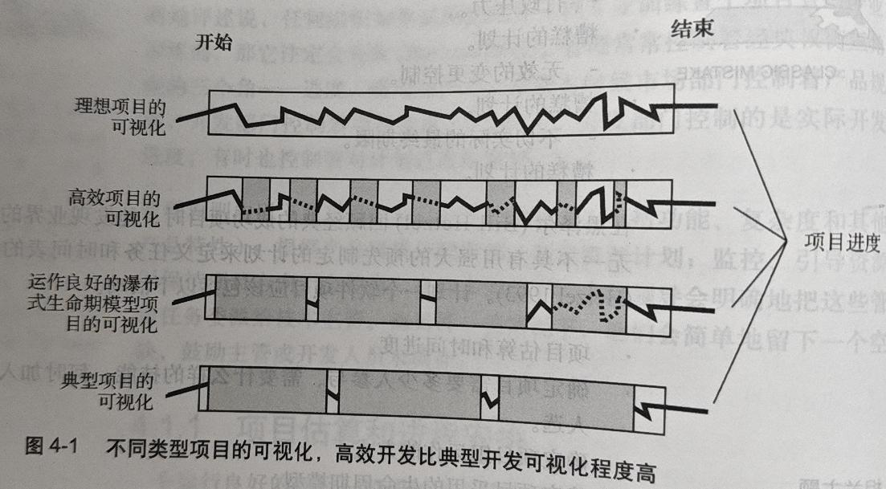

# 4.1 管理原则 P56

- 管理控制权衡三角形的三个顶点: 进度, 费用, 产品(规格和特性).

- 管理原则组成部分:

  1. 判定产品规模(包括功能\复杂度\其他产品特性)
  2. 根据产品规模分配资源
  3. 制定资源计划
  4. 监控\引导资源以保持项目方向不会偏离

- 在许多情况下, 上级领导会明确的把这些管理任务委派给技术主管.

- 另一些情况下, 他们会简单地留下一个空缺, 鼓励主管或开发人员来填补.

## 4.1.1 项目估算和进程安排

> 第8章(估算)\第9章(进度表) 

- 制定软件开发进度表:
  1. 估算产品规模
  2. 根据产品规模估算所需资源
  3. 制定进度表

- 估算和项目进度计划是软件开发的基础.

- 估算产品规模的常用方法:
  - 功能点分析
  - 类比估算
  - 专家判断

## 4.1.2 计划编制

- 糟糕的计划比其他的麻烦更经常地会激起问题之源的爆发.

- 糟糕的计划:
  - 不清楚的合同
  - 多变的问题定义
  - 缺乏经验的管理
  - 行政压力
  - 无效的变更控制
  - 不切实际的最终期限

> P57
- 最佳项目通常具有用强大的预先制定的计划来定义任务和时间表的鲜明特征.

- **计划一个软件项目应该包括以下活动:**
  - 项目估算和时间进度
  - 确定项目需要多少人参与\需要哪些技能\何时加入\具体人选
  - 确定项目组运作方式
  - 确定项目采用的生命周期模型
  - 管理风险
  - 确定项目策略, 例如, 如何控制产品的特色, 是否需要购买或自建部分产品.

> 第12\13\7\5\14章详细介绍了这些活动.

## 4.1.3 跟踪

> 第27章详细介绍了项目跟踪.

- 检查: 进度\费用\质量等目标

- 管理级跟踪控制:
  - 任务列表
  - 进展状况会议(检查)
  - 进展报告
  - 里程碑审查
  - 预算报告
  - 走查管理

- 技术级跟踪控制:
  - 技术审查
  - 技术升级
  - 标志着里程碑是否完结的质量关口

> P58
- 对项目状态的正确度量和有利的跟踪很明显地存在于每一个"最佳项目"之中.

- 图4-1 显示了高效开发比典型开发可视化程度高.

### 4.1.4 度量

> 第26章详细介绍了软件度量.

- 保证软件公司长期可持续运作的关键是能够收集基准数据以分析软件质量和生产率.

> P59
- 实质上就是收集全部项目中有关费用和进度的数据.

- 深入洞察需要一些历史数据: 多大的软件有多少行代码或者其他度量数据等

- 就可以在将来的项目中得到比光凭本能想象更好的依据.

- 基本尺度:
  - 收集数据的尺度基准
  - 用来分析状态\质量和生产率的详细基准