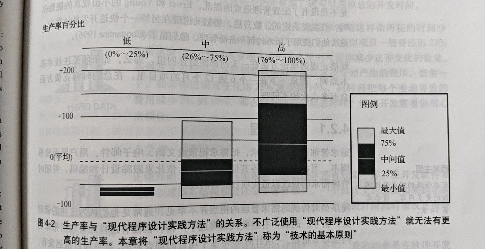

# 4.2 技术的基本原则 P60

- 研究详细论述了不使用这些技术基本原则就不可能有高的生产率和高质量的软件产品.

> P61

- 示例: 分阶段进行开发并且具有中途交付能力.

- 正规配置管理: 阶段性备份

## 4.2.1 需求管理

> P62

- 需求管理包括需求的收集\分析\记录\跟踪\变更控制等活动.

> 第14章详细介绍了需求管理.

- 收集需求:
  - 文档
  - 电子邮件
  - 用户界面故事脚本
  - 可实现的原型

- 需求管理不当:
  - 项目推迟发布
  - 超出预算
  - 功能比预期减少

- 具体原因:
  - 缺乏用户介入
  - 不完善的需求分析
  - 用户不断改需求

- 需求管理的基础:
  - 需求分析方法: 结构分析\数据结构分析\面向对象分析
  - 系统建模时间: UML\数据流图\实体关系图
  - 沟通实践: 联合应用开发\用户界面原型\常规会谈实践
  - 需求管理和其他生命周期类型的关系: 渐渐远行\阶段交付\螺旋模型\瀑布型\编码修正

> P63
- 需求管理调节作用:
  - 控制范围蔓延
  - 提高用户满意度
  - 改善产品质量
  - 加快开发速度

## 4.2.2 设计

- 设计的基本原则: 模块化和信息隐匿.

> 第19章详细介绍了设计流程.

- 体系架构和设计的基本原则:
  - 主要设计风格: 对象设计\结构化设计\数据结构设计
  - 基础设计概念: 模块化\信息隐匿\抽象化\封装\聚合\耦合\层次\继承\多态\基本算法\基本数据结构
  - 对具有典型挑战性事件的标准设计: 异常处理\国际化\本地化\便携性\串存储\输入/输出\内存管理\并发处理\数据存储\浮点运算\数据库设计\性能和复用
  - 对特殊领域应用程序设计的独有考虑: 财务应用\科学应用\嵌入式系统\实时系统\分布式系统\安全性高的系统
  - 架构安排: 子系统组织\分层机构\子系统通信方式\典型的系统架构
  - 设计工具的使用

> P64

## 4.2.3 构建

- 当开始构建时, 项目成功与否大多就已经注定了.

- 需求管理和设计对开发进度计划的调节作用比构建的调节作用大得多.(小的变动可以导致进度大幅变化)

> P65

- 构建的基本原则:
  - 编码实践
  - 数据相关概念
  - 特定数据类型的使用方针
  - 控制相关的概念
  - 断言和其他易代码为核心的错误检测实践方法
  - 对例程\模块\类\文件代码打包规则
  - 单元测试和调试实践方法
  - 集成策略
  - 代码优化策略和实践
  - 与所使用的特定编程语言相关的其他事情
  - 使用构建工具

## 4.2.4 软件配置管理(SCM)

- SCM的基本原则:
  - 版本控制
  - 变更控制
  - 构建管理
  - 发布管理
  - 配置审计

