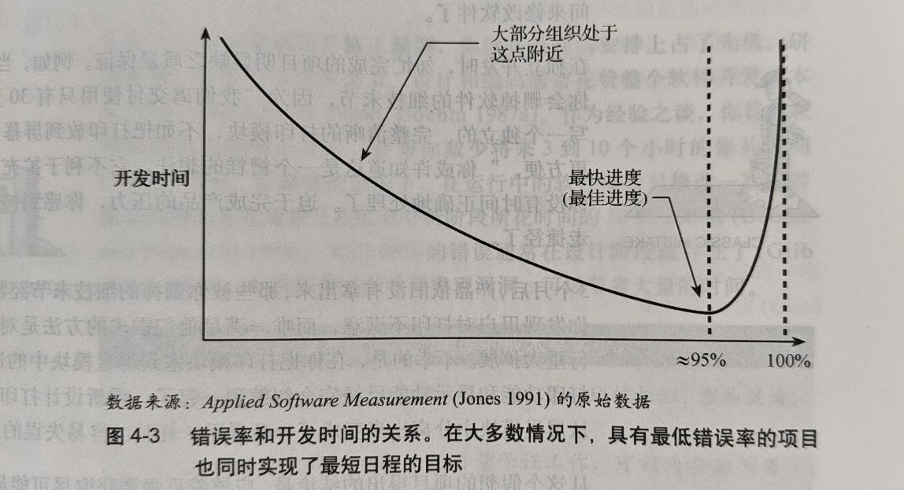
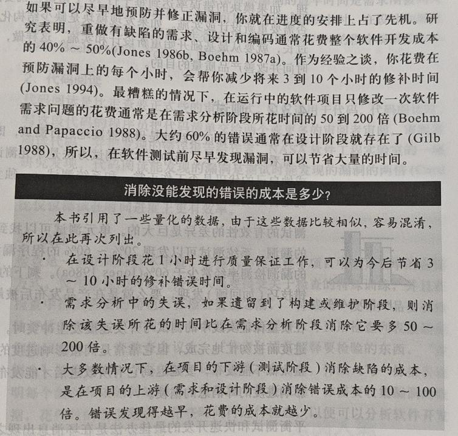
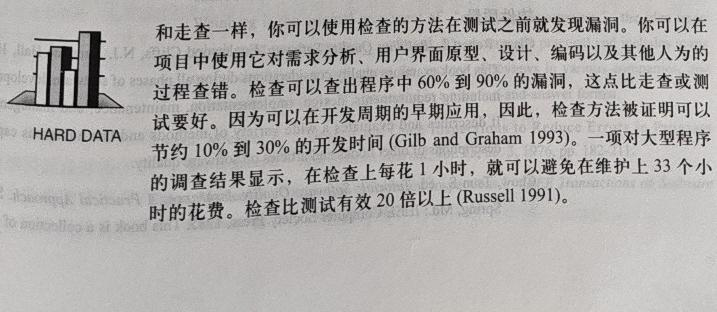

# 4.3 质量保证的基本原则 P68

## 开始

- 当产品有太多的错误时, 开发人员修补它花费的时间可能比编写它所需的时间还要多.

- 远离错误的关键就是从第一天开始就注意执行质量保证(QA)的基本原则.

> P69
- 高的质量(指错误率较小的情况)和短的开发时间是相辅相成的, 为了要获取最快的开发速度而做出的这些决定(缩减设计和测试阶段)是最坏最差的决定.

- 具有最少缺陷的产品也就是具有最短开发时间的产品.

- 糟糕的质量是进度被拖延的最普遍的原因之一.

> P70
- 在独立开发时, 匆忙完成的项目明显缺乏质量保证.

- 在过大的时间压力下发布的产品, 其错误率是正常情况下的4倍.

- 进度有问题的项目经常是在进行艰苦的工作而不是轻松活跃的工作, 关注质量被认为有些奢侈.

> P71

## 4.3.1 易错模块

- 易错模块是那些容易存在或多或少漏洞的模块.

- 高错误率的模块开发起来要比其他模块更加昂贵和耗时.

> P72
- 易错模块往往比系统中其他模块更复杂, 缺乏结构化, 或者不同寻常的庞大, 并且尝尝在背负额外的时间压力下开发, 往往没有被完全测试过.

**目的**: 节约时间并改善产品质量的目的.

- 如果开发速度很重要, 那么就需要鉴别出那些是易错模块, 并将其优先处理.

- 如果模块的错误率达到每千行代码10个错误, 就要回归一下以决定是否需要重新设计或实施.

- 如果发现模块是缺少结构化, 过于复杂, 或者过长, 就要从最基础开始重新设计和实施.

## 4.3.2 测试

- 两种基本的测试方法: 单元测试和系统测试
  - 单元测试: 由程序员在编码后进行的测试, 以确保模块按预期工作.
  - 系统测试: 由独立的测试团队进行的测试, 以确保整个系统按预期工作.

- 平衡测试和快速开发的最佳办法是在坏消息出现之前做好计划, 设置对坏消息的测试, 尽早发现问题.

## 4.3.3 技术审查

- 技术审查包括在需求\设计\编码\测试等时间中用于查错的所有类型的审查.

> P73

### 1. 走查

- 走查是由开发者主持的非正式会议, 其目的是发现错误并改进软件产品.(设计和规范编写完之前)

### 2. 代码阅读

- 代码阅读能发现的漏洞是测试时能发现的漏洞的两倍多.

### 3. 检查

- 检查是一种正式的审查形式, 它被认为是在整个项目中最具效率的查错方式.

- 检查会议前流程:
  1. "仲裁人"发布产品要被检验评估的消息
  2. "审阅人"在会议前检查程序, 并且用检查列表激励他们的回顾工作

- 检查会议流程:
  1. "作者"解释要检验的东西
  2. "审阅人"报告他们发现的错误
  3. "书记员"记录所有发现的错误
  4. "仲裁人"总结会议, 并且指定后续步骤

- 在项目中使用检查对需求分析\用户界面原型\设计\编码\其他人为的过程查错.

> P74
### 4. 对技术审查的说明

- 技术审查是对测试很有用和重要的补充.

- 审查比测试更趋向于发现不同的错误. 发现漏洞越早, 对开发进度的加快就越有好处.

- 成本花费比较经济: 回顾技能发现表面的漏洞又能同时发现潜在的漏洞.

- 同时给程序员提供一个互相共享最佳实践知识的论坛, 随着时间推移可以增强他们快速开发的能力.

- **技术回顾**是每个希望达到最短开发时间的项目的一个重要组成部分.

